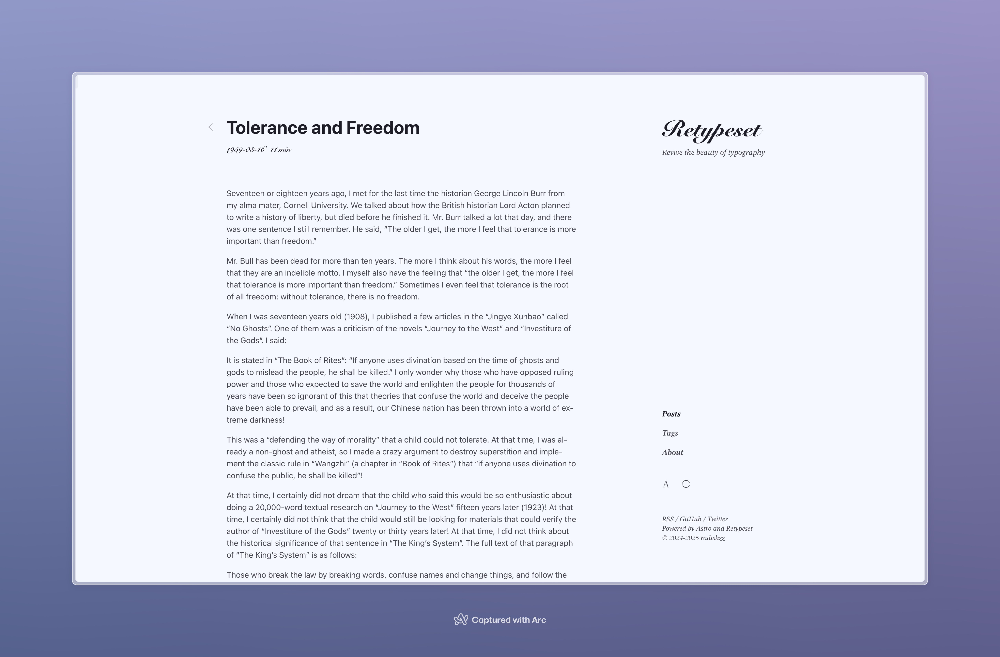
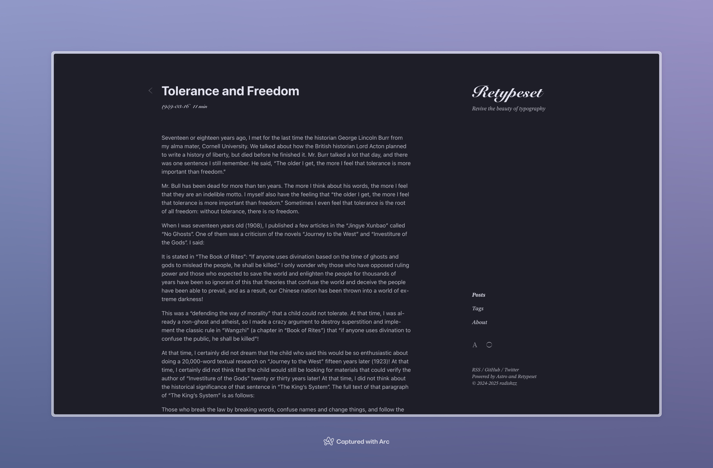

rsl. Бои за Крым [Текст]: Сборник статей и документов — Система онлайн-просмотра.

## Описание

| Поле | Значение |
|---|---|
| Заглавие | Бои за Крым [Текст]: Сборник статей и документов |
| Коллекции ЭК РГБ | Каталог документов с 1831 по настоящее время |
| Коллекции ЭБ РГБ | — |
| Дата поступления в ЭК РГБ | 27.10.2011 |
| Дата поступления в ЭБ РГБ | 14.10.2020 |
| Каталоги | Книги (изданные с 1831 г. по настоящее время) |
| Сведения об ответственности | Крымская комис. по истории Великой Отечественной войны |
| Выходные данные | Симферополь: Красный Крым, 1945 |
| Физическое описание | 255 с.: портр.; 20 см |
| Язык | Русский |
| Места хранения | FB Я 91/1018, FB Я 91/1019, FB ВО 788/15 |

## Содержание

Бои за Крым входят яркой страницей в историю Великой Отечественной войны.

Крым является благодатным уголком советской земли. Это богатый и роскошный край, издавна привлекавший алчные взоры иноземных захватчиков. Крым имеет важное стратегическое значение. Кто владеет Крымом и прекрасной Севастопольской бухтой, тот господствует на черноморских коммуникациях. Немцы, кроме того, желали использовать Крым как плацдарм для наступления на Кавказ и страны Востока.

Вот почему гитлеровцы, несмотря на огромные потери, рвались к Крыму.

22 июня 1941 года утром первые бомбы упали на Севастополь. Осенью того же года немцы подошли к Перекопу. Началась борьба за Крым…

Наш сборник имеет целью ознакомить читателей с основными этапами этой почти трехлетней борьбы. Он состоит из статей и материалов, опубликованных в центральной и крымской периодической печати. Важнейшее место среди них занимают приказы и телеграммы Верховного Главнокомандующего Маршала Советского Союза товарища СТАЛИНА, относящиеся к боям за Крымский полуостров и Севастополь. В сборнике приведен также ряд сообщений Совинформбюро.

Открывается сборник очерком, показывающим героическое нападение немецко-фашистских разбойников на главную базу Черноморского флота Севастополь в первый день войны. Замыкается он письмом товарищу Сталину, посланным трудящимися Симферополя 14 мая 1944 года по случаю победоносного окончания Крымской кампании и освобождения всего Крыма.

В особом разделе помещены материалы о боевых действиях крымских партизан в тылу фашистских захватчиков.

В сборнике представлена лишь очень небольшая часть материалов и документов, относящихся к истории боев с немецко-фашистскими захватчиками за Крым. Но и в таком виде он окажется большим подспорьем пропагандистам и агитаторам, и его бесспорно прочтут все интересующиеся историей борьбы за освобождение Крыма от немецких захватчиков.

Материалы сборника подготовили к печати тт. Р. М. Вуль и Е. П. Степанов.