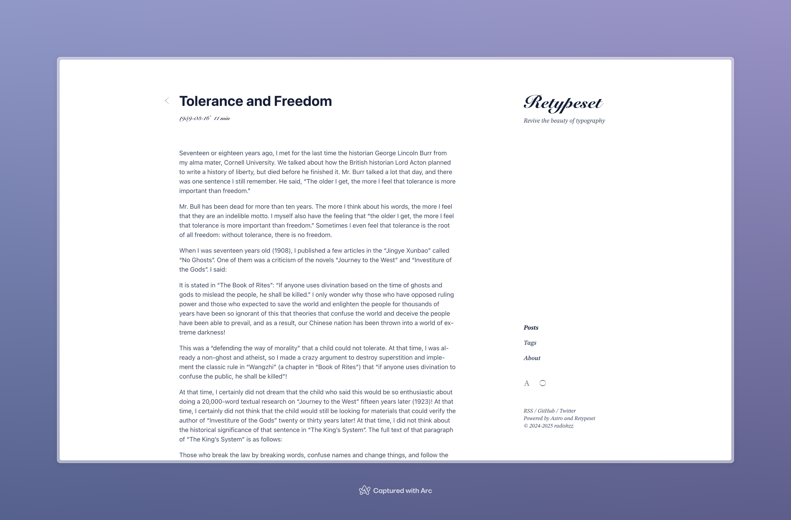
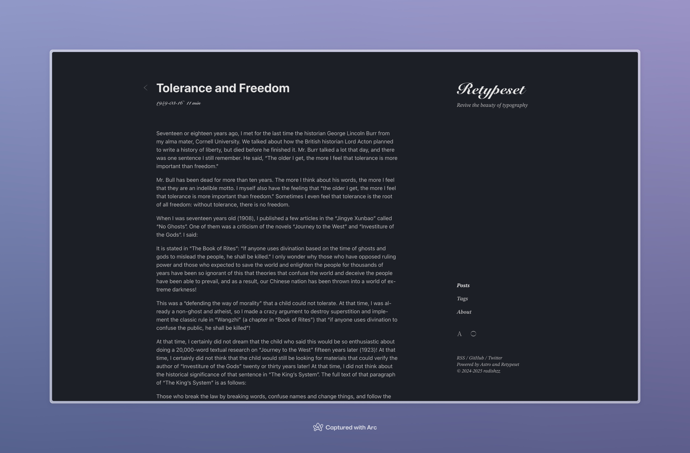

Автор из индекса http://bospor.com.ua/articles/6783.shtml.

Пулеметчица Нина Фатеева. Помним, гордимся / № 18 от 4 мая 2017.

Нам хорошо известно имя Нины Ониловой — Героя Советского Союза, командира пулеметного расчета 54-го стрелкового полка 25-й Чапаевской дивизии, участницы второй обороны Севастополя. Сегодняшний же рассказ о ее тезке и коллеге по военной специальности, участнице освобождения Керчи и Севастополя, командире пулеметного отделения Нине Фатеевой.

Нина Николаевна Фатеева родилась в 1915 году в г. Уральске (Западный Казахстан). В июне 1942 года написала заявление в Краснодарский горвоенкомат и добровольцем ушла на фронт. Сначала была санитарным инструктором. Первую награду — медаль «За отвагу» — получила за то, что с 26 по 28 октября 1942 года вынесла с поля боя 67 раненых бойцов и командиров с личным оружием.

Сама получила ранение, а уже после госпиталя попала в 1339-й стрелковый полк 318-й стрелковой дивизии, где стала пулеметчицей. К слову, женщины-пулеметчицы воевали только в Красной Армии.

Однажды Нина пришла к начальнику штаба майору Ковешникову, заявила: «Не хочу быть санинструктором, отправьте меня на передовую пулеметчицей».

— Для этого, прежде всего, надо хорошо знать пулемет, — сказал Ковешников.

— А вы проверьте!

Начальник штаба убедился, что Фатеева отлично изучила «Максим». «Десятки раз мужественная пулеметчица отражала вражеские атаки. За год она трижды была ранена, но, возвращаясь из госпиталя, снова брала свой «Максим», — писал о мужественной девушке командир дивизии В. Ф. Гладков в книге «Атакует горнострелковая».

Старший сержант Фатеева — участник десантной операции по освобождению города Новороссийска. Высадившись со своим пулеметом в новороссийской бухте, сходу повела губительный огонь по отходящему противнику, уничтожив не менее 40 солдат. В бою у поселка Гайдук Нина Фатеева была ранена, но нашла возможность передать свой пулемет в хорошем состоянии. По выздоровлении вернулась в свою часть. За образцовое выполнение боевых заданий командования на фронте борьбы с немецкими захватчиками и проявленные при этом доблесть и мужество старший сержант Фатеева Нина Николаевна награждена орденом Красной Звезды.

Подробности тех боев оставил майор запаса А. Погорелов, бывший командир 1-го стрелкового батальона 1339 СП 318 СД: «Наше положение тоже было нелегким. Если при высадке на берег роты еще соблюдали неписаный закон десанта — держаться локтя соседа, то по мере продвижения вперед эта связь нарушалась, бой принимал очаговый характер. Положение усугублялось тем, что мы наступали в гору и противник имел возможность вести по нас огонь как бы в несколько ярусов — из подвалов, окон домов, чердаков… Под шквальным огнем пулеметов погибли почти все минометчики, артиллеристы, и моряки не могли им помочь, так как точно не знали, где какая рота находится — единого фронта не было. В сложившейся обстановке я принял решение создать свою маневренную огневую группу в составе двух станковых пулеметов и трех противотанковых ружей. Меткими очередями пулеметчики Нина Фатеева и Степан Гурин вместе с бронебойщиками подавляли огневые точки врага на самых напряженных участках, и дело поправлялось».

Как известно, 318-й Новороссийская стрелковая дивизия первой высаживалась на крымский берег 1 ноября 1943 года, участвуя в Керченско-Эльтигенской десантной операции. Сведений об участии Нины Фатеевой в десанте и боях на эльтигенском плацдарме нет, по всей видимости, она в тот период еще находилась на излечении в госпитале.

После эвакуации в декабре 1943 года оставшихся в живых участников Эльтигенского десанта, 318-я дивизия расположилась в г. Тамани и обороняла берег Таманского полуострова.

В начале февраля 1944 года 318-я Новороссийская стрелковая дивизия переправилась через Керченский пролив и заняла позиции на северо-восточной окраине Керчи. При наступлении дивизии 16 марта 1944 года командир пулеметного отделения старший сержант Фатеева огнем из пулемета дала возможность бойцам захватить вражеские траншеи и подавила огонь трех вражеских огневых точек, стоявших на пути следования наступающих бойцов. В этом бою пулеметным огнем Нина Фатеева уничтожила до 30 немецких солдат и офицеров. Отважная пулеметчица была ранена, но не ушла с поля боя до окончания боевой операции.

За проявленные мужество, храбрость и отвагу Н. Н. Фатеева была удостоена ордена Славы 3-й степени. Получала высокую правительственную награду в госпитале, где находилась после четвертого тяжелого ранения. Всего Нина Николаевна Фатеева получила пять тяжелых ранений, но каждый раз после госпиталя возвращалась на передовую.

При освобождении Севастополя пулеметный расчет старшего сержанта Фатеевой оказывал огневую поддержку стрелковому подразделению при взятии высоты Горной — ключевого пункта немецкой обороны. Группа бойцов в составе до взвода попала в трудную обстановку, и тогда пулемет Фатеевой заставил залечь немцев, чем дал возможность выйти нашим бойцам из создавшегося положения. За свой подвиг Нина Фатеева была представлена к ордену Отечественной войны 2-й степени, но наградой стала медаль «За боевые заслуги».

Пять ранений, два ордена, две медали — такой след оставила Великая Отечественная война в жизни Нины Николаевны Фатеевой, отважной пулеметчицы, простой русской женщины, вставшей на защиту Родины в трудное для нее время. Как почти миллион советских женщин разных возрастов, профессий и национальностей — известных и забытых героинь, надевших солдатские шинели и внесших неоценимый вклад в Великую Победу.

Оксана Шеремет. На фото: Н. Н. Фатеева.